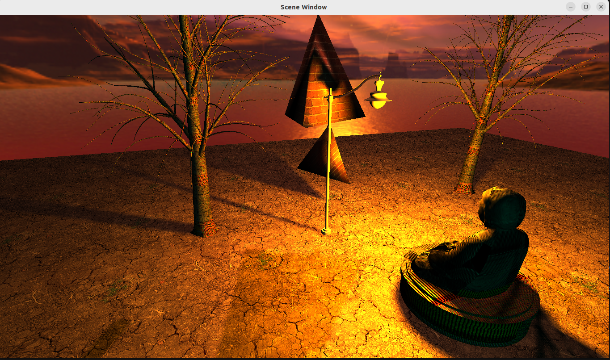

# OpenGL-Framework
C++ Application with OpenGL on Ubuntu in order to display visuals. Also include GLFW, assimp libraries in order to work with models, shaders and textures. Through shaders, classes for lights and shadows in order to implement visual effects, skyboxes and ability to create any visual component as mesh is implemented.

The work took a similar approach to Dane Cook's OpenGL course but since i am building this up on Ubuntu, i had to take different approaches to find workable solutions. Some factors were easier to implement and others were a lot more difficult. During the course, i took notes from theory lessons in OpenGLNotes.cpp. Feel free to check and comment accordingly.
My first attempt in utilizing C++ with openGL Framework is in this repository. Tasks completed are as follows:

- Creation of a window and initiating GLEW and GLFW.
- Creation of a triangle on a 2D Window using GLEW and GLFW.
- Integration of GLM (OpenGL maths library) for matrix operations.
- Transforming objects in terms of translation, rotation and scaling.
- Creating shader objects and binding them to relevant shaders (vertex/geometry/fragment).
- Creation of a 3D pyramid using indices and vertices with Mesh class with indexed draws.
- Creation of projections and its use on various mechanics.
- Addition of Camera and User Input with GLFW.
- Camera Controls and escape button to close the graphics window.
- Texture and Image loading and texture mapping.
- Phong Lighting Model, analyzing ambient, diffuse and specular lighting.
- Directional lights, Point lights and spot lights.
- Importing 3D Models with proper textures.
- Shadow Mapping.
- Directional and Omnidirectional Shadow Maps, Cube Maps and the Geometry Shader.
- Adding a Skybox using the cubemap.

Below you may find an image of finalized works. Im aware there are things that needs to be polished but this is the result:

There is much more inside the code aside from these headers. However, i plan to improve this as follows:

- Code Refactoring (Need to polish on my C++ first).
- Model class revision (to be able to read blender files etc).
- Additional features related to game development such as Collision detection algorithms.
- Analyze the code and take what is needed to create a 2D game.
- Additional features using Dear Imgui UI library to start the engine works.
- Make at least one 2D game using this library.

There is also much more to be done, but im proud where it got so far.
Feel free to make comments and contact me if you have any ideas related to it.
